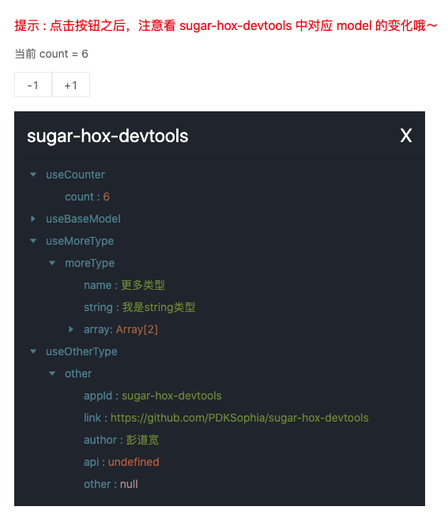
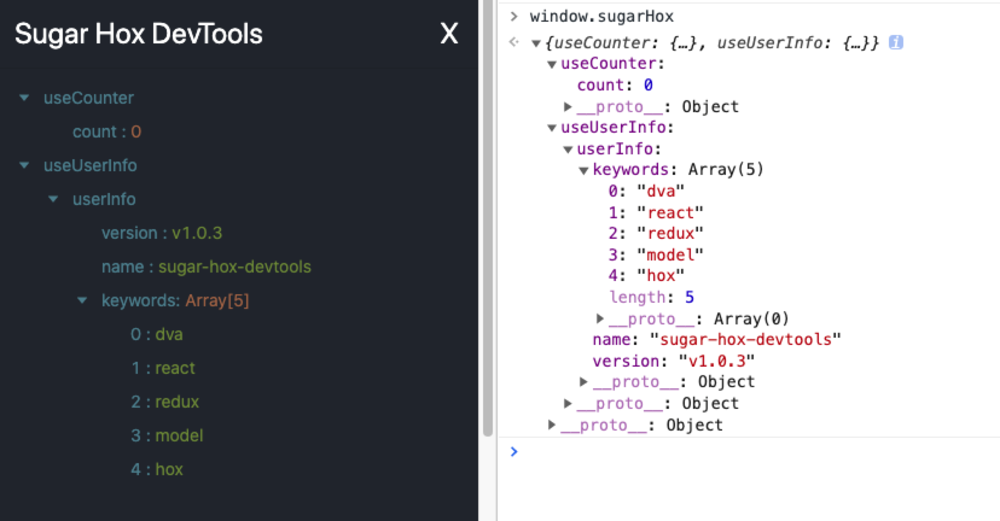

# SugarHoxDevTools 👋


## 相关说明

- `SugarHoxDevTools`是一个组件，用于展示被 `createModel` 包裹的数据。[更多功能计划中]

- 修改了 hox 一小部分源码，如果依赖 hox 包，那么得在打包的时候，webpack 注入我自己修改的部分代码，相对麻烦，成本也高。于是邮箱问过 [umi/hox](https://github.com/umijs/hox)的开发者之一[brickspert](https://github.com/brickspert)，经过同意且此仓库为 MIT 协议，所以 fork 了此仓库并拉取源码进行修改，相关 API 仍保持与 hox 一致

- 之所以做这个 devTools，原因在于我们使用了 createModel 包裹之后，不知道这个数据是否真的被持久化、全局共享，只能通过在组件中 import 这个数据源，然后 console.log 打印，然后看是否真的被修改。

- 还有就是当其他人接收之后，他想获取一些已经存在于全局共享的 Model，并没有一个展示全局共享数据的 Model，所以 `SugarHoxDevTools` 出生了。

## 如何使用

> **与你正常写 hooks，使用 hox 一样，只要经过 createModel 包裹后的 hooks，修改数据源之后，可以在 devtools 组件中，实时看到对应 model 的变化哦～**

## 快速开始

### 安装

```bash
npm install sugar-hox-devtools --save
```

### 创建一个 model

> 这里的说明拷至 hox 文档，[更多详情点击这里访问](https://github.com/umijs/hox/blob/master/README-cn.md#%E5%88%9B%E5%BB%BA%E4%B8%80%E4%B8%AA-model)

```js
import { useState } from 'react'
import hoxAPI from 'sugar-hox-devtools'

function useCounter() {
  const [count, setCount] = useState(0)
  const decrement = () => setCount(count - 1)
  const increment = () => setCount(count + 1)
  return {
    count,
    decrement,
    increment,
  }
}

useCounter.namespace = 'useCounter' // 这里需要给每一个 model 都添加命名空间标识

export default hoxAPI.createModel(useCounter)
```

### 使用 model

> 这里的说明拷至 hox 文档，[更多详情点击这里访问](https://github.com/umijs/hox/blob/master/README-cn.md#%E4%BD%BF%E7%94%A8-model)

```js
// 在组件中调用这个 Hook ，就可以获取到 model 的数据了。
import counterModel from '../models/counter'

function App(props) {
  const { counter, increment, decrement } = counterModel()
  return (
    <div>
      <p>{counter}</p>
      <button onClick={decrement}>-1</button>
      <button onClick={increment}>+1</button>
    </div>
  )
}
```

### 开启 DevTools

`sugar-hox-devtools` 抛出一个组件，调用此组件即可；所有经过`createModel`包裹后的 model，都会被注入添加到 `window.sugarHox` 上。控制台打印 window.sugarHox 就能拿到数据。

```js
import React, { useState } from 'react'
import sugar from 'sugar-hox-devtools'

const SugarHoxDevTools = sugar.SugarHoxDevTools

function App() {
  const [showDevTools, setShowDevTools] = useState(true)

  return (
    <div>
      ...
      {showDevTools && (
        <SugarHoxDevTools onClose={() => setShowDevTools(false)} />
      )}
    </div>
  )
}
```

## 组件参数

| 参数            | 说明                | 类型       | 默认值             |
| --------------- | ------------------- | ---------- | ------------------ |
| title           | 自定义              | string     | sugar-hox-devtools |
| closeIcon       | 关闭 icon           | ReactNode  | X                  |
| onClose         | 点击 closeIcon 方法 | () => void | -                  |
| maxScrollHeight | 容器滚动的最大高度  | number     | 200                |

## 部分截图





## Maintainers

[@PDKSophia](https://github.com/PDKSophia)

[@SugarTurboS](https://github.com/SugarTurboS)

## Contributing

PRs accepted.

## License

MIT © 2020 PDKSophia/SugarTurboS

## Related Links

- [hox](https://github.com/umijs/hox)
- [rc-redux-model](https://github.com/SugarTurboS/rc-redux-model)
- [SugarTurboS](https://github.com/SugarTurboS)
